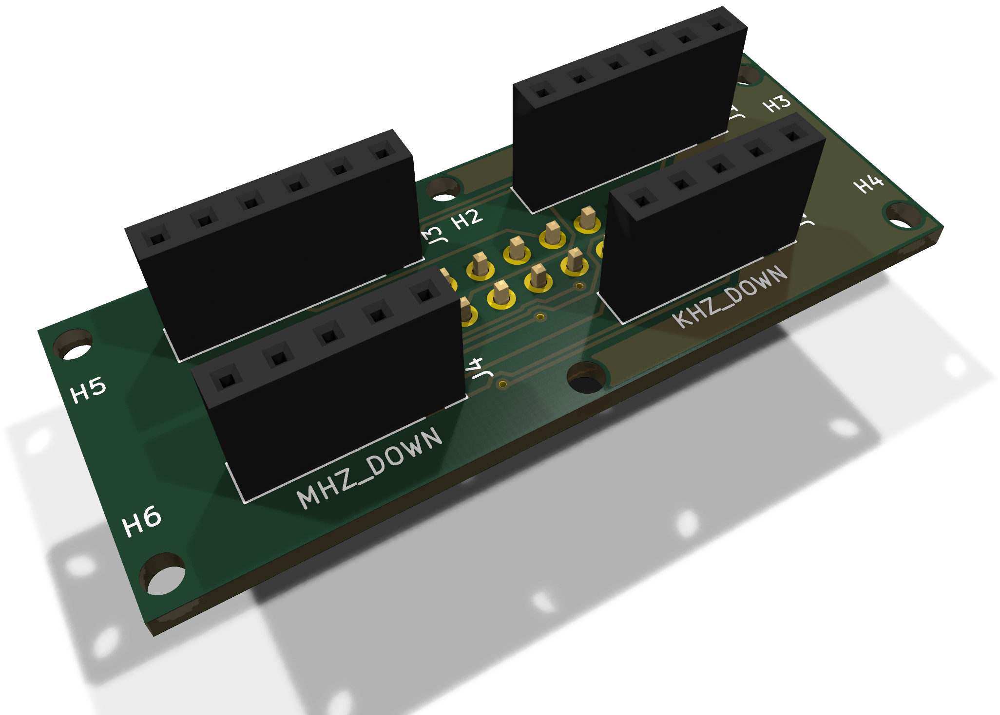
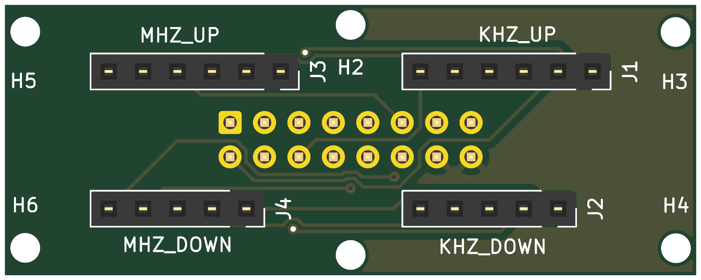
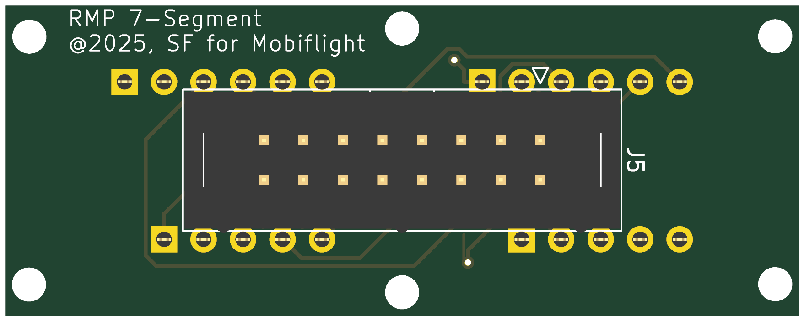

# RMP 7Segments

The carrier of one frequency display: two 3-digit 7-segment displays,
MHz and kHz, side by side. **Two are needed**, one for ACTIVE and one for
STBY. Each sits in its printed display case and reaches the MainPanel
through a 16-pin ribbon.

* **PCB:** 51 × 20 mm, 2 layers, 1.6 mm, GND poured on both sides.
* **Fixing:** six M2 holes.
* **Parts:** 5: four socket strips for the displays on the top, one header
  on the bottom.
* **Status:** built and in use. ERC and schematic parity are clean; DRC
  reports only silkscreen clipped by the solder mask around J5.

| Top: the display sockets | Bottom: J5 |
|---|---|
|  |  |

Rendered by KiCad from the board file. The bottom is seen from below, so it
is mirrored against the top.

## Connectors

| Ref | What | Notes |
|---|---|---|
| J1 / J2 | Socket strips 1 × 6 / 1 × 5 | kHz display, upper and lower row of pins |
| J3 / J4 | Socket strips 1 × 6 / 1 × 5 | MHz display, upper and lower row of pins |
| J5 | Shrouded IDC header 2 × 8, on the bottom | To MainPanel J7 (ACTIVE) or J8 (STBY), pin 1 to pin 1 |

**J5:** odd pins are the segments, 1 A, 3 B, 5 C, 7 D, 9 E, 11 F, 13 G,
15 the decimal point; even pins are the digits, 2 / 4 / 6 kHz 3 / 2 / 1,
8 / 10 / 12 MHz 3 / 2 / 1; 14 and 16 GND.

The displays must be **common cathode**: the MAX7219 sinks the digits and
drives the segments. The decimal point is wired on both displays; which digit
shows it is set in the MobiFlight project.
