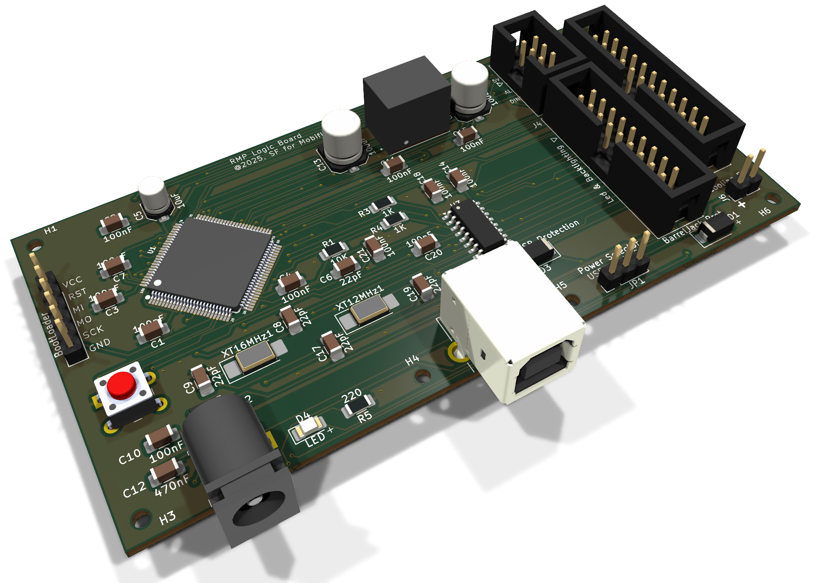
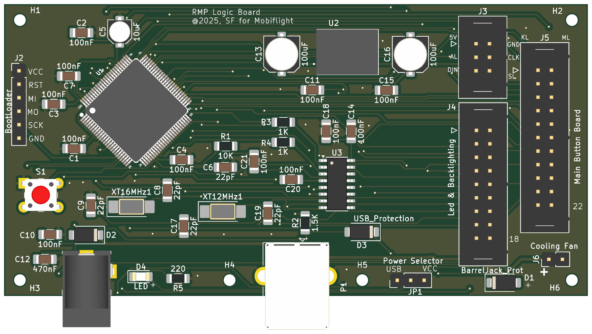
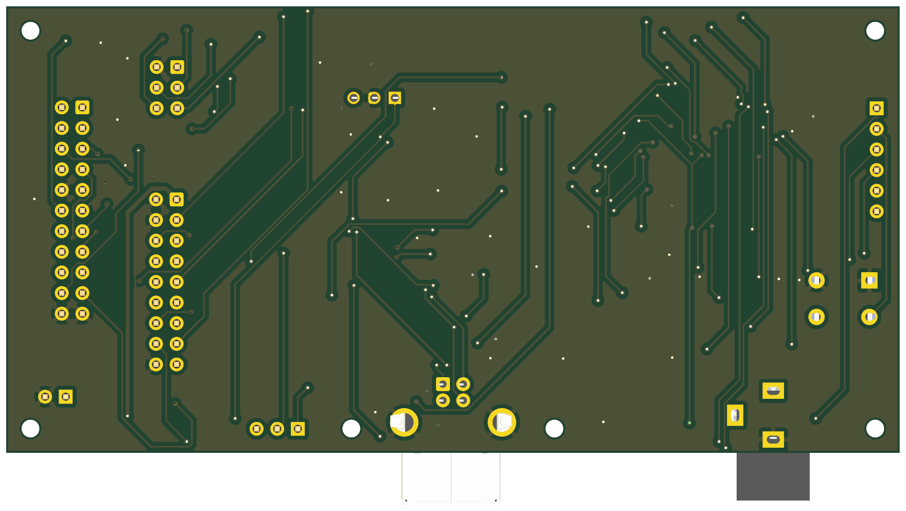

# RMP BoardPanel

The logic board of the RMP: the microcontroller, USB and power. It stands
upright on the printed support at the back of the case and reaches the
MainPanel through three ribbons.

* **PCB:** 110 × 55 mm, 2 layers, 1.6 mm, GND poured on both sides.
* **Fixing:** six M2 holes.
* **Parts:** 44, all on the top.
* **Status:** built and in use. ERC, DRC and schematic parity are clean.

| Top | Bottom |
|---|---|
|  |  |

Rendered by KiCad from the board file. The bottom is seen from below, so it
is mirrored against the top.

## What is on it

* **Microcontroller:** ATmega2560 (U1) with a 16 MHz crystal, and a CH340G
  (U3, 12 MHz crystal) for USB. MobiFlight sees it as a Mega.
* **Power:**
  * 12 V from the barrel jack J1, through D2, is the `+12V` rail: the
    backlight (J4) and the fan (J6).
  * From `+12V`, through D1, a P78A05 switching module (U2) makes the 5 V
    for the two MAX7219 only (J3).
  * The ATmega and the CH340G run from USB, through D3 and JP1. The
    displays and the backlight need the 12 V; the logic does not.

## Connectors and settings

| Ref | What | Notes |
|---|---|---|
| J1 | 12 V in, 5.5 × 2.1 barrel jack | Pin 1 `+`, through D2 |
| P1 | USB-B | To the computer |
| J2 | ISP header, 1 × 6 | 1 VCC, 2 RESET, 3 MISO, 4 MOSI, 5 SCK, 6 GND |
| JP1 | Power selector | 1–2: MCU from USB (normal use). 2–3: MCU from J2's VCC only, to burn the bootloader |
| J3 | Displays, IDC 2 × 3 | To MainPanel J9 |
| J4 | LEDs and backlight, IDC 2 × 9 | To MainPanel J2 |
| J5 | Buttons and encoders, IDC 2 × 11 | To MainPanel J3 |
| J6 | Cooling fan, 2 pins | `+12V` and GND, for a 12 V fan |
| S1 | Reset | |

Every ribbon is straight, pin 1 to pin 1.

**J3, displays:** 1 `+5V`, 2 GND, 3 D67 (marked `AL`, no longer used, see
the MainPanel), 4 CLK (D22), 5 DIN (D23), 6 LOAD (D68).

**J4, LEDs and backlight:** 1 `+12V`, 2 GND, 3 backlight PWM (D6), 4 GND,
5–17 the thirteen key LEDs (A0–A12, in the order VHF1, VHF2, VHF3, HF1,
HF2, AM, NAV, VOR, ILS, MLS, ADF, BFO, SEL), 18 GND.

**J5, buttons and encoders:** see the pin map in the
[main readme](../Readme.md#mobiflight).

## Burning the bootloader

A new ATmega2560 is blank. Put JP1 on 2–3, so the programmer powers the
MCU alone through J2, and burn the Arduino Mega bootloader once. Then put
JP1 back on 1–2. From then on the board is flashed over USB like a Mega.

## Assembly notes

* Everything is sized for hand soldering: 1206 passives, 5 × 3.2 mm
  crystals.
* Values, polarity and pin 1 are on the silkscreen.
