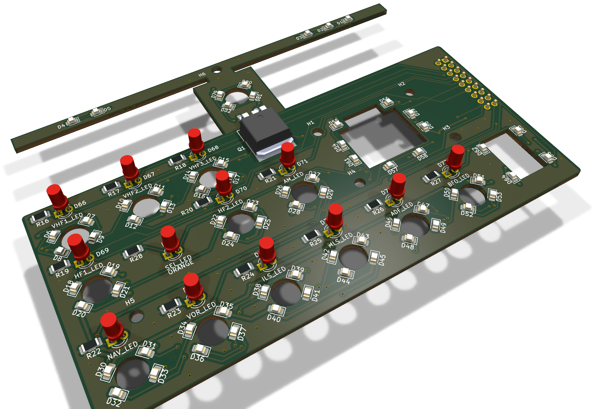
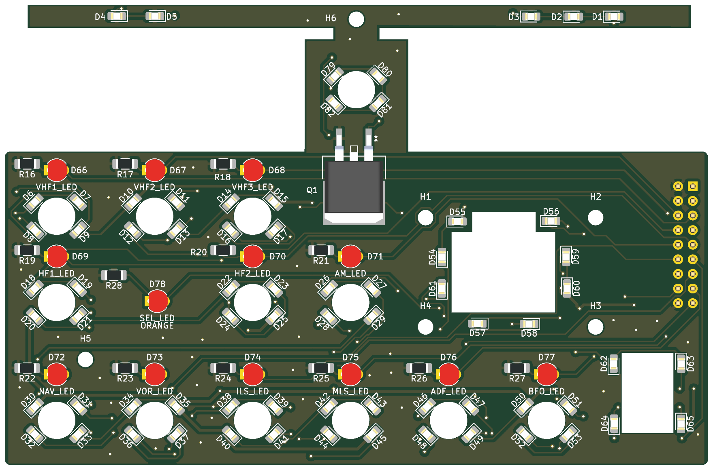
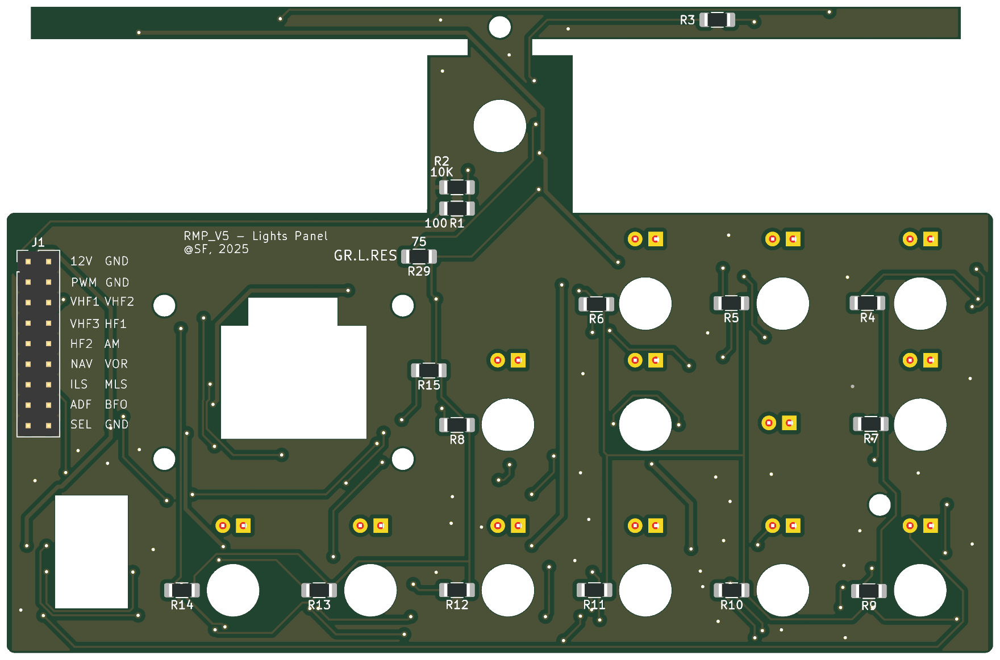

# RMP LedsPanel

The lighting board, right behind the front panel: the backlight of the
legends and the thirteen key lights. It plugs straight into the MainPanel.

* **PCB:** 122 × 80 mm, 2 layers, 1.6 mm, GND poured on both sides.
* **Fixing:** six M2.5 holes.
* **Parts:** 113. The backlight resistors and J1 are on the bottom.
* **Status:** built and in use. ERC, DRC and schematic parity are clean.

| Top: the panel side | Bottom: resistors and J1 |
|---|---|
|  |  |

Rendered by KiCad from the board file. The bottom is seen from below, so it
is mirrored against the top.

## Connector

| Ref | What | Goes to |
|---|---|---|
| J1 | Header 2 × 9, on the bottom | Plugs into the MainPanel's J1. 1 `+12V`, 2 / 4 / 18 GND, 3 backlight PWM, 5–17 the key LEDs |

## Backlight

69 orange 0805 LEDs, chosen to match the brightness of the Airbus panels,
on `+12V`:

* D1–D65: thirteen strings of five, each with its 75 Ω (R3–R15);
* D79–D82: one string of four, with R29, 75 Ω.

Every string returns to `LED_RETURN`, switched to GND by Q1, an IRLZ44N
(logic-level N-MOSFET, D2PAK). Its gate is driven by the backlight PWM
(D6) through R1, 100 Ω, with R2, 10 kΩ, pulling it down: with the PWM at 0
or the MobiFlight Connector closed, the backlight is off.

The string of four has one LED fewer across the same 75 Ω, so it carries
more current than the strings of five.

## Key lights

D66–D78, 3 mm flat-top LEDs, one in each key. The anode is driven straight
by the MCU pin through J1; the cathode goes to GND through 200 Ω
(R16–R28).

| D66 | D67 | D68 | D69 | D70 | D71 | D72 | D73 | D74 | D75 | D76 | D77 | D78 |
|---|---|---|---|---|---|---|---|---|---|---|---|---|
| VHF1 | VHF2 | VHF3 | HF1 | HF2 | AM | NAV | VOR | ILS | MLS | ADF | BFO | SEL |

The key lights are not dimmed. On the aircraft they follow the ANN LT
switch, apart from the backlight; a separate dimmer for them is being
considered.

## Assembly notes

* Everything is sized for hand soldering: 0805 LEDs, 1206 resistors.
* LED polarity, values and pin 1 are on the silkscreen.
