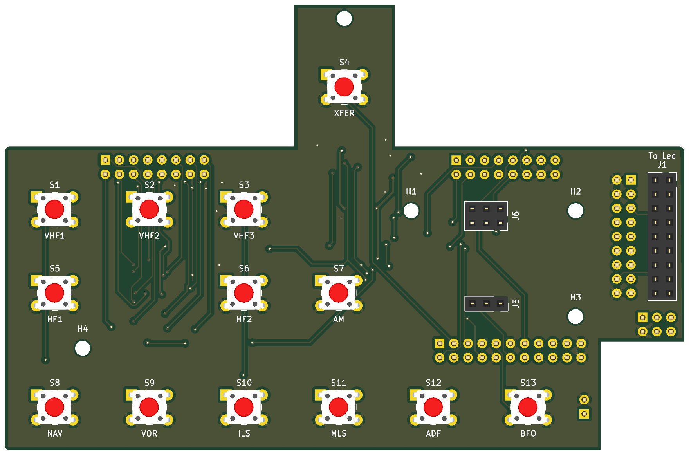
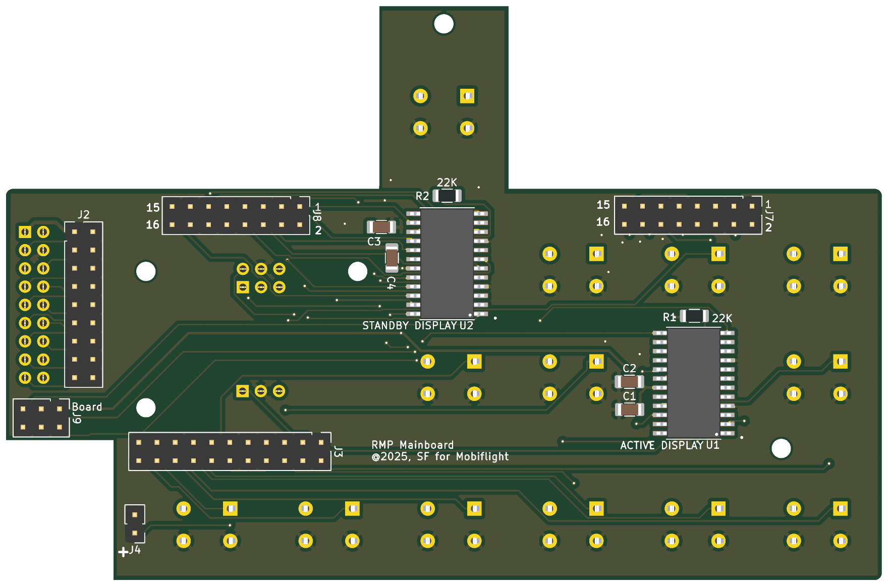

# RMP MainPanel

The board behind the front panel: the thirteen keys, the two MAX7219 that
drive the frequency displays, and the connectors for the encoders, the
ON/OFF switch, the LedsPanel and the two display boards. It reaches the
BoardPanel through three ribbons.

* **PCB:** 122 × 80 mm, 2 layers, 1.6 mm, GND poured on both sides.
* **Fixing:** five 2.5 mm holes.
* **Parts:** 30. On the top: the keys, J1 for the LedsPanel and the two
  encoder sockets. On the bottom: the two MAX7219 with their passives, and
  the headers to the BoardPanel, the display boards and the ON/OFF switch.
* **Status:** the display chain is corrected in this revision (see below)
  and rerouted. ERC, DRC and schematic parity are clean. The corrected
  board has not been ordered yet.


| Top: the keys | Bottom: drivers and connectors |
|---|---|
|  |  |

Rendered by KiCad from the board file. The bottom is seen from below, so it
is mirrored against the top.

## Connectors

| Ref | What | Goes to |
|---|---|---|
| J1 | Socket 2 × 9 | The LedsPanel's J1 plugs in here. Same pins as J2 |
| J2 | Header 2 × 9 | BoardPanel J4: backlight, PWM, the thirteen key LEDs |
| J3 | Header 2 × 11 | BoardPanel J5: keys, encoders, ON/OFF |
| J9 | Header 2 × 3 | BoardPanel J3: the display bus |
| J7 | Header 2 × 8 | ACTIVE display board, its J5 |
| J8 | Header 2 × 8 | STBY display board, its J5 |
| J5 | Socket 1 × 3 | kHz encoder: 1 `RADIO_KHZ_LEFT` (D25), 2 GND, 3 `RADIO_KHZ_RIGHT` (D27) |
| J6 | Socket 2 × 3 | MHz encoder: 2 `RADIO_MHZ_LEFT` (D26), 4 GND, 6 `RADIO_MHZ_RIGHT` (D28). Pins 1, 3, 5 are not connected |
| J4 | Header 1 × 2 | ON/OFF switch: 1 to D41, 2 GND |

Every connection is pin 1 to pin 1. The pinouts of J2, J3 and J9 are in
the [BoardPanel readme](../BoardPanel/README.md#connectors-and-settings).

## The keys

S1–S13, 6 × 6 mm tactile switches, each between its input and GND. The
MCU's internal pull-ups hold the inputs high.

| S1 | S2 | S3 | S4 | S5 | S6 | S7 | S8 | S9 | S10 | S11 | S12 | S13 |
|---|---|---|---|---|---|---|---|---|---|---|---|---|
| VHF1 | VHF2 | VHF3 | XFER | HF1 | HF2 | AM | NAV | VOR | ILS | MLS | ADF | BFO |

## The displays

Two MAX7219 in one chain, as MobiFlight expects for one LED module of two
devices:

```
D23 (DIN) ─► U2 STBY ─► DOUT ─► U1 ACTIVE
D22 (CLK) ─► U1 and U2
D68 (LOAD) ─► U1 and U2
```

U2 is the first device in the chain, so in MobiFlight connector 1 is the
standby frequency and connector 2 the active one. Each chip drives six
digits, three for MHz and three for kHz, through J7 / J8 to its display
board. R1 and R2 (22 kΩ) on `ISET` set the segment current; C1–C4 decouple
the two chips.

### Boards built before this revision

The first MainPanel had the two chips side by side on D23, with a LOAD
each (D67 for the Active, D68 for the Standby), and nothing on either
DOUT. That board works only with two hand-soldered wires, on the bottom:

1. pin 12 (LOAD) of U1 to pin 12 of U2;
2. pin 24 (DOUT) of U2 to pin 1 (DIN) of U1.

In the production files of that board, U1's pin 1 is also tied to D23 by
copper, which with the second wire gives it two drivers. If the Active
display shows the odd wrong segment now and then, check with the power off
for continuity between pin 1 of U1 and pin 1 of U2. If there is, cut the
track close to U1 pin 1.

## Assembly notes

* Everything is sized for hand soldering: 1206 passives, SOIC-24W chips.
* Values, polarity and pin 1 are on the silkscreen.
