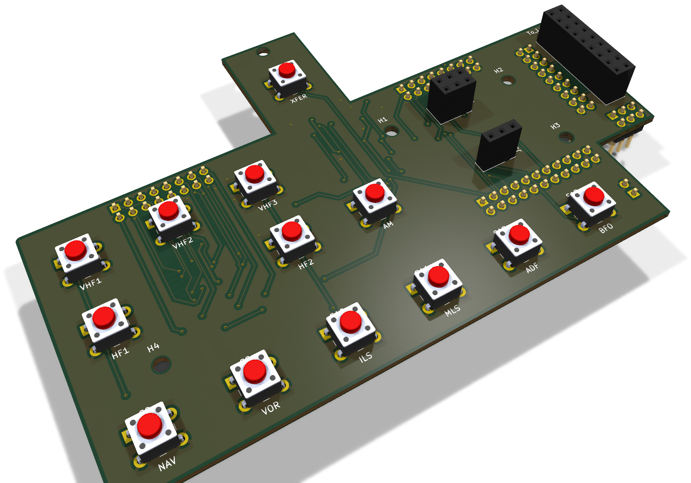

# Radio Management Panel (RMP)

An Airbus A319/320/321 Radio Management Panel for MobiFlight: a 3D-printed
front panel, keys and case, four boards, and two 6-digit frequency displays.
It runs on the **stock MobiFlight Mega firmware**: no custom firmware to
build or flash.



## V5 in short

V5 replaces the earlier version of this repository, a single board with
OLED displays and its own firmware. It is a new design:

* **four boards** instead of one: the logic, the keys and display drivers,
  the lighting, and a carrier for each frequency display;
* **7-segment displays** driven by two MAX7219, which MobiFlight drives
  natively as one LED module;
* **stock firmware**, MobiFlight Mega, core 3.1.4;
* the printed parts are drawn in **FreeCAD 1.1**.

**Status (October 2026):** the unit is built and in use. The boards in this
repository are the built ones, with one correction on the MainPanel (see
[Known issues](#known-issues)). All four are in KiCad 10, with ERC, DRC and
schematic parity clean. The printed parts are being reorganised.

## What is in the repository

| Folder | What it holds |
|---|---|
| [`BoardPanel/`](BoardPanel/README.md) | The logic board: ATmega2560, CH340G USB, 12 V and 5 V supply |
| [`MainPanel/`](MainPanel/README.md) | The keys, the two MAX7219, and the connectors to every other board |
| [`LedsPanel/`](LedsPanel/README.md) | The backlight and the thirteen key lights |
| [`7Segments/`](7Segments/README.md) | The carrier of one frequency display. Two are needed |
| `Libraries/` | The parts shared by the four boards: `RMP.kicad_sym`, `RMP.pretty` and the vendor 3D models in `3dmodels/` |
| `SF_RMP/` | `SF RMP.mfmc`, the MobiFlight board config |
| `3D FIles/` | The FreeCAD sources (`RMP_Panel.FCStd` is the whole assembly), the STL files, the B612 fonts of the legends. Being reorganised |

## The boards

```
 12 V jack ─► BoardPanel ─┬─ J4 ribbon ─► MainPanel J2 ─► J1 ─► LedsPanel (plugged in)
 USB-B     ─►             ├─ J5 ribbon ─► MainPanel J3   keys, encoders, ON/OFF
                          └─ J3 ribbon ─► MainPanel J9 ─┬─ J7 ribbon ─► 7Segments ACTIVE
                                                        └─ J8 ribbon ─► 7Segments STBY
```

| Board | PCB (mm) | What is on it |
|---|---|---|
| [BoardPanel](BoardPanel/README.md) | 110 × 55 | ATmega2560, CH340G, USB-B, 12 V jack, P78A05 5 V module, ISP header |
| [MainPanel](MainPanel/README.md) | 122 × 80 | 13 keys, 2 × MAX7219, encoder and switch connectors |
| [LedsPanel](LedsPanel/README.md) | 122 × 80 | 69 backlight LEDs with their PWM switch, 13 key lights |
| [7Segments](7Segments/README.md) × 2 | 51 × 20 | Two 3-digit common-cathode displays, MHz and kHz |

All four are two-layer, 1.6 mm boards, sized for hand soldering, with
values, polarity and pin 1 on the silkscreen.

## Building one

1. **Print** the panel, keys, case and supports from `3D FIles/`.
2. **Order the boards.** Run the Fabrication Toolkit plugin in each KiCad
   project for the Gerbers, BOM and positions. Order the 7Segments twice.
3. **Assemble** them. The board readmes list what to watch for.
4. **Cable them** as in the diagram above: straight ribbons, pin 1 to
   pin 1. The LedsPanel plugs straight into the MainPanel's J1.
5. **Burn the bootloader** once through the ISP header J2 of the BoardPanel,
   with JP1 on 2–3; then put JP1 back on 1–2. See the
   [BoardPanel readme](BoardPanel/README.md#burning-the-bootloader).
6. **Flash the MobiFlight Mega firmware** from the MobiFlight Connector,
   then load `SF_RMP/SF RMP.mfmc` and upload it to the board.
7. **Bind** the keys, lights, displays and encoders in your MobiFlight
   project.

The BoardPanel's logic runs from USB; the 12 V adapter feeds the backlight,
the displays and the fan.

## MobiFlight

Stock **MobiFlight Mega** firmware, module name `SF RMP`. The config in
`SF_RMP/SF RMP.mfmc` holds:

| Device | Type | Pins |
|---|---|---|
| `Display Freq` | LED module, MAX7219, 2 devices | DIN D23, CLK D22, CS D68. Connector 1 = STBY, connector 2 = ACTIVE |
| `Dimmer` | Output, PWM | D6, the backlight |
| `KHZ_Encoder` | Encoder | Left D27, right D25 |
| `MHZ_Encoder` | Encoder | Left D28, right D26 |
| `VHF1_LED` … `SEL_LED` | Outputs | A0–A12 (D54–D66): VHF1, VHF2, VHF3, HF1, HF2, AM, NAV, VOR, ILS, MLS, ADF, BFO, SEL |

| Key | Pin | Key | Pin | Key | Pin |
|---|---|---|---|---|---|
| XFER | D29 | HF2 | D36 | MLS | D31 |
| VHF1 | D39 | AM | D35 | ADF | D30 |
| VHF2 | D15 | NAV | D34 | BFO | D40 |
| VHF3 | D14 | VOR | D33 | ON/OFF | D41 |
| HF1 | D37 | ILS | D32 | | |

Each MAX7219 drives six digits; the decimal point after the MHz is set in
the project row of each display.

## Known issues

* **The first MainPanel had the two MAX7219 side by side instead of in a
  chain.** The files here are corrected. A board built from the first files
  needs two wires, described in the
  [MainPanel readme](MainPanel/README.md#boards-built-before-this-revision).
* **Two STL files are empty:** the white parts of the VHF1 and VHF3 keys.
  They will be re-exported from FreeCAD with the reorganisation of the
  printed parts.

## Software

* [KiCad](https://www.kicad.org/) 10. The files are saved by KiCad 10 and
  do not open in older versions
* [FreeCAD](https://www.freecad.org/) 1.1, to change the printed parts
* [MobiFlight](https://www.mobiflight.com/)

```bash
git clone https://github.com/stefanofinetti/MF_RMP_Panel.git
```

## License

This code and all the items are released under the GPLv3.0 license. Feel free
to use them as you wish, as long as you redistribute the source code.
A mention would be nice, though, if you use this work: I invested a good
many hours in it, just for the amazing MobiFlight community.

## Acknowledgements

This project couldn't have seen the light without the excellent work, and
kind support, of [GaGagu](https://github.com/gagagu) and
[ElRal](https://github.com/elral). Their work is amazing, so please have a
look at their repositories.
